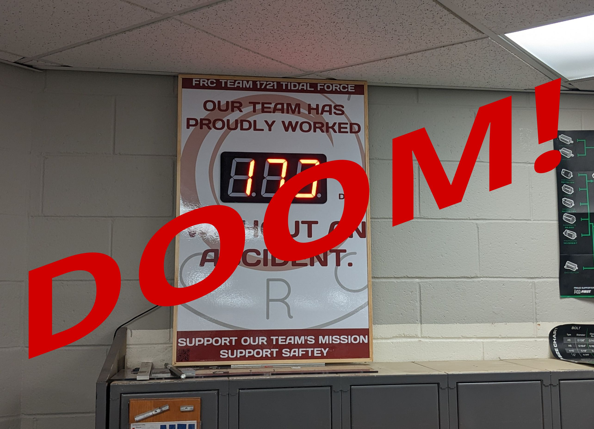

[](https://github.com/FRC-1721/AccidentCounter/actions/workflows/hardware_workflow.yml)
[](https://github.com/FRC-1721/AccidentCounter/actions/workflows/firmware_workflow.yml)

Watch the [Youtube Video here.](https://www.youtube.com/watch?v=R463rN57n-0)



# Welcome!

This repo contains all the firmware and hardware for Tidal Force's "Days
Worked Without Incident" counter.

If you're looking for the latest docs/builds, see our [Releases Page](https://github.com/FRC-1721/AccidentCounter/releases).

# Getting Started

First, clone this repo (and optionally checkout a branch)

```shell
git clone https://github.com/FRC-1721/AccidentCounter.git
cd AccidentCounter
git checkout new_board
```

# Init Submodules

Some libraries and resources are included as submodules, run the following
command to initialize them before opening the main sch

(If you get a missing library error, make sure to do this)

```shell
git submodule update --init --recursive
```
